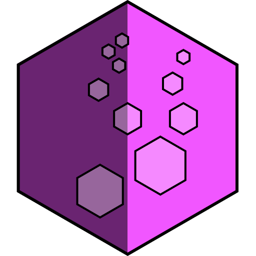

# Bubblez v2.0.0

A gem for easily defining client REST interfaces in ruby

> If you're using Rails, it's suggested to have a `config/initializers/bubblez.rb` configuration file where you can easily configure your endpoints and environments. If you're not using Rails, then you can put this configuration just about anywhere, provided it's executed before where you want to use it.

## Quickstart
In `config/initializers/bubblez.rb`, add the following:
```ruby
require 'bubblez'

Bubblez.configure do |config|
  config.add_api(name: 'MyApi',
                 environments: [{
                                  :scheme => 'http',
                                  :host => '0.0.0.0',
                                  :port => '1234'
                                }],
                 endpoints: [
                   {
                     :method => :get,
                     :location => :version,
                     :authenticated => false,
                     :api_key_required => false
                   }
                 ])
end
```

The `config` object is the root of the `bubblez` configuration. It contains one or more API configurations, each added using the `add_api` method. Each API configuration must have a unique name.

The `endpoints` parameter of the method  is where you configure which endpoints you want to support.
The `environments` parameter of the method defines the environments, or remote configurations, for accessing the
endpoints on specific remote destinations.

Now, you can use this endpoint with:
```ruby
require 'bubblez'
...

def version
  resources = Bubblez::Resources.new 'Default'

  # The following will make a GET request to
  # http://0.0.0.0:1234/version and return the result.
  result = resources.environment.version

  puts(result)
end
```

## Detailed Documentation
A `bubblez` configuration is made up of API configurations, each of which should specify a single uniform API definition.
Each API configuration is specified with the `add_api` method.

There are currently two parts to a `bubblez` API configuration: the _environments_ and the _endpoints_. Bubblez is
configured in a _bubblez configuration block_:

```ruby
Bubblez.configure do |config|
  # You can add configuration for Bubblez here using config[<API name>].endpoints and config[<API name>].environments
end
```

This configuration block can be run at any time, but is typically set up in the initializer section of an app's startup.
If desired, configuration can happen separately. That is, you can initialize `environments` within your initializer file
and then initialize `endpoints` within another section of the application. Just note that when `endpoint`s are defined,
it overwrites _all_ endpoints of a configuration, not just the ones you choose to change.

The `add_api` method is a shorthand notation for specifying the `environment`s and `endpoint`s of an API configuration
in one method call. It's not explicitly necessary. The configuration block below is perfectly valid:
```ruby
Bubblez.configure do |config|
  # Note: No `add_api` call is made here. This usually wouldn't be that handy when definining the environments and
  #       endpoints all at once, but if you're definining them at different times, it's sometimes necessary to skip the
  #       call to add_api in favor of just implicitly defining the API name.
  config['Default'].environments = [{
                                      :scheme => 'http',
                                      :host => '0.0.0.0',
                                      :port => '1234'
                                    }]
  config['Default'].endpoints = [{
                                    :method => :get,
                                    :location => :version,
                                    :authenticated => false,
                                    :api_key_required => false
                                }]
end
```

### Environments
You can set up any number of `environment`s in `bubblez`. If you choose to have more than one, though, each of these
environments requires that you specify an `environment_name` parameter to uniquely identify it. If you specify multiple
environments with the same `environment_name`, only the environment with this name that was defined _last_ will take
effect.

#### Configuration of Environments
Environments are configured as part of the _bubblez configuration block_ and can have the following parameters:

  - `scheme`: The scheme for accessing endpoints on this host. Should be one of `http` or `https`. Defaults to `http`.
  - `host`: A domain name or IP address for the remote host to access for the environment.  Defaults to `127.0.0.1`.
  - `port`: The port to use to access the remote host. Defaults to `1234`.
  - `api_key`: The API key to send along with requests for a given environment, if an API key is required. This is optional, and defaults to `nil`.
  - `headers`: A `Hash` of key-value pairs that contain additional headers to pass to every call to this endpoint. Defaults to `{}`.
  - `environment_name`: A `String` containing the name of the environment. This `String` can be anything, but it should be unique to the specified environment. If only one environment is specified in the array, it is not necessary to provide an `environment_name`.

##### Example: Configuring three environments
Consider the possibility of wanting to configure three environments for a single API named 'MyApi':
  - A _development_ environment, accessed via `http` and using `localhost` as the host and `1234` as the port
  - A _staging_ environment, accessed via `https`, and using `stage.foamfactory.io` as the host and `8080` as the port
  - A _production_ environment, accessed via `https` and using `api.foamfactory.io` as the host and `80` as the port

You can configure all of these environments at once in the _bubblez configuration block_:
```ruby
Bubblez.configure do |config|
  config['MyApi'].environments = [{
    :scheme => 'http',
    :host => '0.0.0.0',
    :port => '1234',
    :environment_name => 'development'
  },
  {
    :scheme => 'https',
    :host => 'stage.foamfactory.io',
    :port => '8080',
    :environment_name => 'staging'  
  },
  {
    :scheme => 'https',
    :host => 'api.foamfactory.io',
    :port => '80',
    :environment_name => 'production'
  }]
end
```

If you choose a scheme of `http` and leave off the `port` configuration variable, it will default to `80`. Similarly,
`https` will default to a port of `443`.

You can now access the environments using the method `RestClientResources.environment`:

```ruby
resources = Bubblez::Resources.new 'MyApi'
staging_environment = resources.environment 'staging'
```

The `environment_name` parameter is optional if you have only a single `Environment`. In this case, you can access a
single environment by leaving the parameter off of the call to `resources.environment`:
```ruby
resources = Bubblez::Resources.new 'MyApi'

# Note: This line will raise an error if there is more than one Environment defined
environment = resources.environment
```

#### Configuration of Endpoints
Endpoints are the meat and potatoes of REST interaction. By indicating a _method_, _uri_, _body_, and _headers_, you 
are effectively making a function call on a remote server.

_Endpoints_ are specified as an array of objects within the _bubblez configuration block_:

```ruby
config[<API name>].endpoints = [
  # Individual endpoint definitions go here
]
```

When processing each of these endpoint definitions, a method is created on instances of `RestEnvironment` that allows
you to call the method in question. For example, an endpoint defined as:
```ruby
{
  :method => :get,
  :location => :version,
  :authenticated => false,
  :api_key_required => false
}
```

will create a method on instances of `RestEnvironment` called `version`, which will execute the appropriate REST call
(via `RestClient`) and return a `RestClient::Response` object.

Each _endpoint_ object can have the following attributes:

| Name    | Description         | Required? | Default |
| :---    | :------------------ | :-------: | :-----: |
| `method`| The HTTP method to use to access the API for this endpoint. Must be one of `GET`, `POST`, `PUT`, `PATCH`, `DELETE`, or `HEAD`. | Yes | N/A |
| `location`| The path to access the endpoint. This is placed after the `host:port` section to build the URI. It may have URI parameters in the form of `{paramName}`. If a URI parameter is specified within the `location`, a `uri_params` hash will be expected to be passed to the calling method to replace the placeholder values. | Yes | N/A |
| `name` | The name to give the method created to make this REST call. | No | The value of the `location` parameter, with slashes (`/`) replaced with underscores (`_`). |
| `authenticatedd` | Whether or not this endpoint requires authentication prior to executing the call. If true, then an `Authorization` header will be added to the request. If the `encode_authorization` flag is also set, then the `Authorization` will be of type `Basic` and a base64-encoded `username:password` string will be added as the value. If the `encode_authorization` flag is not set, then an auth token will be expected as part of the method's parameters and will be passed with an authorization type of `Bearer` within the header.| No | `false` |
| `api_key_required` | Whether or not an API key is required. If `true`, a parameter will be added to the method created to execute the REST API call named `api_key`. The value of this parameter will be set as the value of the `X-Api-Key` header when making the REST API call. | No | `false` |
| `return_type` | Must be one of: `[full_response, body_as_object, body_as_string]`. This specifies what type of response is expected from the `Endpoint`. A value of `full_response` will return the full `RestClient::Response` object to the client. A value of `body_as_string` will return the `RestClient::Response.body` value as a `String`. A value of `body_as_object` will take the `RestClient::Response.body` parameter and parse it as an `OpenStruct` object, and return the result of this parsing operation. | No | `body_as_string` |
| `encode_authorization` | Whether the `data` passed as part of the request should be re-encoded as an `Authorization: Basic` header (and Base64 encoded). Typically, this is only used for initial username/password authentication. | No | `false` |
| `headers` | A `Hash` of key-value pairs specifying additional headers (the `key` specifies the name of the header, and the `value` specifies the value) that should be passed with each call to this `Endpoint`. Defaults to `{}`.

### Examples
These examples are taken almost directly from our [test suite](https://github.com/FoamFactory/bubblez/blob/master/spec/bubblez/resources_spec.rb).
For more detailed examples, please refer to our specifications located in the `/spec` directory.

#### GET the version of the software (unauthenticated, no API key required)
**Configuration**:

```ruby
require 'bubblez'

Bubblez.configure do |config|
  config['MyApi'].endpoints = [
    {
      :method => :get,
      :location => :version,
      :authenticated => false,
      :api_key_required => false,
      :return_type => :body_as_object
    }
  ]

  config['MyApi'].environments = [{
    :scheme => 'http',
    :host => '0.0.0.0',
    :port => '1234'
  }]
end
```

**Usage**:
```ruby
it 'should return an object containing the version information from the API' do
  resources = Bubblez::Resources.new 'MyApi'
  environment = resources.environment

  response = environment.version
  expect(response).to_not be_nil
  expect(response.name).to eq('My Sweet API')
  expect(response.versionName).to eq('0.0.1')
end
```

#### GET a specific user by id (authentication via authorization token required)
**Configuration**:
```ruby
Bubblez.configure do |config|
  config[:SinkingMoon].endpoints = [
    {
      :method => :get,
      :location => 'users/{id}',
      :authenticated => true,
      :name => :get_user,
      :return_type => :body_as_object
    }
  ]

  config[:SinkingMoon].environments = [{
    :scheme => 'http',
    :host => '127.0.0.1',
    :port => '9002'
  }]
end
```

**Usage**:
```ruby
it 'should return an object containing a user with id = 4' do
  environment = Bubblez::Resources.new(:SinkingMoon).environment
  
  user = environment.get_user(@auth_token, {:id => 4})
  expect(user).to_not be_nil

  expect(user.id).to eq(4)
end
```

#### GET a specific user by id (authentication via login/password)
**Configuration**:
```ruby
Bubblez.configure do |config|
  config[:SinkingMoon].endpoints = [
    {
      :method => :get,
      :location => 'users/{id}',
      :authenticated => true,
      :encode_authorization => true,
      :name => :get_user,
      :return_type => :body_as_object
    }
  ]

  config[:SinkingMoon].environments = [{
    :scheme => 'http',
    :host => '127.0.0.1',
    :port => '9002'
  }]
end
```

**Usage**:
```ruby
it 'should return an object containing a user with id = 4' do
  environment = Bubblez::Resources.new(:SinkingMoon).environment
  user = environment.get_user 'somelogin', 'somepassword', {:id => 4})
  expect(user).to_not be_nil

  expect(user.id).to eq(4)
end
```

#### POST a login (i.e. retrieve an authorization token)
**Configuration**:
```ruby
Bubblez.configure do |config|
  config['LoginApi'].endpoints = [
    {
      :method => :post,
      :location => :login,
      :authenticated => true,
      :api_key_required => true,
      :encode_authorization => [:username, :password],
      :return_type => :body_as_object
    }
  ]

  config['LoginApi'].environments = [{
    :scheme => 'http',
    :host => '127.0.0.1',
    :port => '9002',
    :api_key => 'someapikey'
  }]
end
```

**Usage**:
```ruby
it 'should return a user data structure with a valid authorization token' do
  environment = Bubblez::Resources.new('LoginApi').environment

  login_object = environment.login 'myusername', 'mypassword'

  auth_token = login_object.auth_token

  expect(auth_token).to_not be_nil
end
```

#### DELETE a user by id
**Configuration**:
```ruby
Bubblez.configure do |config|
  config[:SinkingMoon].endpoints = [
    {
      :method => :delete,
      :location => 'users/{id}',
      :authenticated => true,
      :name => 'delete_user_by_id',
      :return_type => :body_as_object
    }
  ]

  config[:SinkingMoon].environments = [{
    :scheme => 'http',
    :host => '127.0.0.1',
    :port => '9002'
  }]
```

**Usage**:
```ruby
it 'should successfully delete the given user' do
  environment = Bubblez::Resources.new(:SinkingMoon).environment
  response = environment.delete_user_by_id @auth_token, {:id => 2}
  expect(response.success).to eq(true)
end
```

#### PATCH a user's information by providing a body containing information to update
**Configuration**:
```ruby
Bubblez.configure do |config|
  config[:SinkingMoon].endpoints = [
    {
      :method => :patch,
      :location => 'users/{id}',
      :authenticated => true,
      :name => 'update_user',
      :return_type => :body_as_object
    }
  ]

  config[:SinkingMoon].environments = [{
    :scheme => 'http',
    :host => '127.0.0.1',
    :port => '9002'
  }]
```

**Usage**:
```ruby
it 'should update information for the specified user' do
  environment = Bubblez::Resources.new(:SinkingMoon).environment
  response = environment.update_user @auth_token, {:id => 4}, {:user => {:email => 'kleinhammer@somewhere.com' } }

  expect(response.id).to eq(4)
  expect(response.email).to eq('kleinhammer@somewhere.com')
end
```
